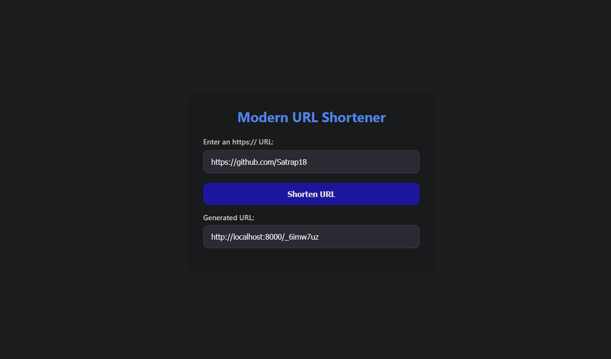
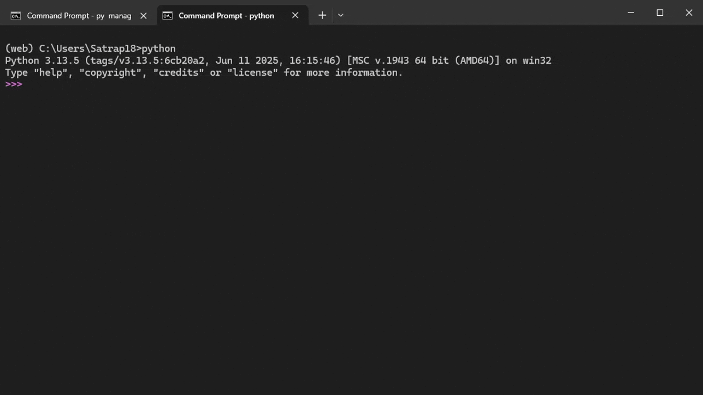

# 🚀 Linkify — Simple URL Shortener

A clean, minimalistic **URL shortener** built with **Django** and **Django REST Framework**. Designed to be easy to run locally, simple to extend, and friendly for developers who want a small, production-ready starting point.

[](https://python.org) [](https://djangoproject.com) [](https://www.django-rest-framework.org) [](LICENSE)

---

## Table of Contents

1. [About](#about)
2. [Demo / Screenshots](#demo--screenshots)
3. [Features](#features)
4. [How it works (high-level)](#how-it-works-high-level)
5. [Quick Start (local)](#quick-start-local)
6. [API Reference](#api-reference)
7. [Contributing](#contributing)
8. [Roadmap](#roadmap)
9. [License](#license)

---

## About

Linkify is a lightweight URL shortener service with a small web UI and a REST API. It stores mappings between short codes and original URLs and exposes a redirect endpoint for short links.
---

---

## Demo / Screenshots

> Web UI



> API demo (example GIF)



---

## Features

* Shorten long URLs into compact short codes
* Redirect short codes to original URLs
* REST API for programmatic use (JSON input/output)
* Minimal and responsive web UI
* Easy to extend (metrics, user accounts, expiry, analytics)

---

## How it works (high-level)

1. Client submits an `original_url` through the web UI or API.
2. The server generates a unique short code (e.g. `206KGCxB`) and stores it with the original URL.
3. The API returns the short link (`short_url`) — typically a full absolute URL like `http://localhost:8000/206KGCxB`.
4. Visiting the short link returns an HTTP redirect (302/301) to the original URL.

---

## Quick Start (local)

**Clone & run**

```bash
git clone https://github.com/satrap18/linkify.git
cd linkify
```

**Create virtual environment**

On macOS / Linux:

```bash
python -m venv venv
source venv/bin/activate
pip install -r requirements.txt
```

On Windows (PowerShell):

```powershell
python -m venv venv
venv\Scripts\Activate.ps1
pip install -r requirements.txt
```

**Run migrations and start server**

```bash
python manage.py migrate
python manage.py runserver
```

Open `http://127.0.0.1:8000/` in your browser and try shortening a link.
---

## API Reference

### Create a short URL

**Endpoint**

```
POST /api/url/
```

**Request (JSON)**

```json
{
  "original_url": "https://github.com/satrap18"
}
```

**Successful Response (example)**

```json
{
  "id": 1,
  "original_url": "https://github.com/satrap18",
  "short_url": "http://localhost:8000/206KGCxB"
}
```

**cURL example**

```bash
curl -X POST http://localhost:8000/api/url/ \
  -H "Content-Type: application/json" \
  -d '{"original_url":"https://github.com/satrap18"}'
```

**Python (requests) example**

```python
import requests
r = requests.post('http://localhost:8000/api/url/', json={'original_url': 'https://github.com/satrap18'})
print(r.json())
```

---
## Contributing

If you'd like to contribute:

1. Fork the repo and create a new branch: `git checkout -b feature/your-feature`
2. Make changes and add tests where appropriate.
3. Open a PR describing the changes.

Please follow PEP8 and keep commits focused and small.

---

## Roadmap

* Click analytics / per-link stats
* Link expiration & password-protected links
* User accounts & dashboards
* Custom slugs

---

## License

This project is licensed under the **MIT License** — see the `LICENSE` file for details.

---

## Maintainers / Contact

* Repository owner: `satrap18` on GitHub
* For questions, open an issue or start a discussion in the repo

*Thanks for building with Linkify — happy shortening!*
